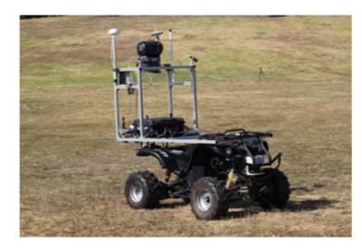
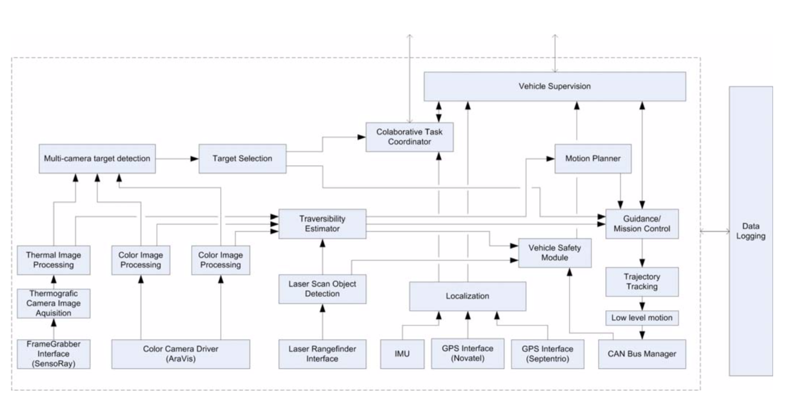
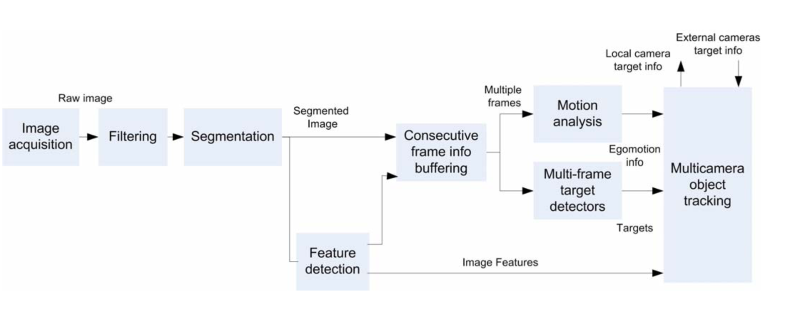

# Autonomy Architectures

## TIGRE - An autonomous ground robot for outdoor exploration
**Terrestrial Intelligent General purpose Robotic Explorer**

### Onboard Sensors
- Uses wireless communication (wireless communications (IEEE 802.11a Ubiquiti Bullet 5GHz access point))
- infra-red pan&tilt thermographic camera (L3 ThermoEye 5000)
- laser rangefinder (SICK LMS- 200)
- visible spectrum camera pair (Basler acA1300-30gc)
- precision GPS receivers (Septentrio PolaRx2e and Novatel Smart Antenna) and inertial sensors (Microstrain 3DM)
- Colour GiGE Cameras - Two for stereo vision

### Hardware Architecture
- Use an external trigger for the cameras
- Main system is in a watertight container

### Software Architecture

- *Multi-camera target detection*: identidied image targets are combined to produve 3D targets (with stereo vision)
- *Target Selection*: Performs tracking and selection of relevant targets
- Targets are used for *Guidance Control* 
- Color based image classification is combined with obstacles detected by the laser rangefinder to determine traversability
- *Localization*: Produces current estimate of the vehicle pose in the world refrence frame (from IMU and GPS) - used for different levels of motion control
- *Data logging occurs at all levels
- *Mission Control*: Produces vehicle trajectories for *Trajectory Tracking*
- *Trajectory Tracking*: Produces low level velocity and position for low level motion controller (`will be wheel speeds in our case, or turn speeds, forward motion speeds, etc. sent to COTS motor controller`)

#### Software Package Usage
- ROS Used for interprocess communications, adding modularity and maintainability and providing a set of useful development and implentation tools
- Large restrictions for multi-robot scenarios and also some limitations on the communications latency and overhead (`this is irrelevant for our current use case`)
- Accurate time synchronization of data is achieved using the Chrony clock-synchronization daemon used with PPS information from the GPS - sync system clock to GPS time (`this is important for us to implement`)
- Video streaming is performed by VLC streamer with MPEG4v codec

#### Control
- Uses a *hybrid system approach*: Uses a hybrid approach to allow both continuous time control with discrete state evolution
- Basic vehicle control - hybrid automata
- Basic path following maneuver is a simple *line of sight controller* using a nonlinear feedback function of the cross track error measured fromo the centre of the front axel to the closest point on the path
- Control law keeps the wheels aligned with the given path by using the steering angle (`We will need to look into control without power steering or do something smart with the wheel speeds`)
- Rollover is an important concern on rough terrain (`We shouldn't worry about this right now, but it is a good motivation to invest in high quality IMUs so that roll angle estimation can be used in the future`)

#### Localization
- Two GPS receievers, and one is a *precision double frequency (RTK capable) receiver* - has dual-frequency (L1/L2) receiver
- GPS accuracy is augmented with Precise Point Positioning (PPP) when satellite orbit and timing information is available (`This is a good feature to have in a future iteration, but it won't be implemented right now`)
- GPS solution precision can be improved with the use of *DGPS-RTK (DIfferential GPS Realtime Kinematic)* - this requires existence of a known base station whose corrections are sent to the vehicle (`We need to look into this as this may be a viable option to provide precise location date`)
- Vehicle localization: Position is obtained directly fromo GPS as vehicle dynamics are relatively slow (`I believe this applies to our robot as well`), Attitude is obtained by the IMU and magnetic compass readings to provide an *Attitude Heading Reference System*
- Position and attitude can be combined in a loosely couples GPS-INS extended kalman filter to obtain a full 6DOF vehicle state - (`We should ideally find a COTS product to all of this (a combined GPS/IMU INSS) - the paper suggest tactical grade INS (iMAR iNAV-FMS-E)`)
- SLAM (using monocular visual odometry) is used for navigation when GPS is unavailable (`We may want to implement this in addition to dead-reckoning`)

!(../images/TIGRE-Hardware-Architecture.png)

#### Vision System

- Based on a pair of colour cameras and an infrared one
- The external synchronized trigger is also synced with the system clock
- Camera and infrared frames at 30fps
- Single frame pipeline and consecutive frame analysis
- Consecutive frame analysis used for visual odometry, 3D positioning (from multi-camera information)

## A Modeling Framework for Software Architecture Specification

## An Extensible Software Architecture for Composing Motion and Task Planners

## Development of Autonomous Car – Part I: Distributed System Architecture and Development Process

#### Centralized System Architecture

- Most functional components of the autonomous driving system are implemented into a single computing unit
- Has many weaknesses
  - High computational ability because all of the devices, including 

## Intelligent Robotic Car for Autonomous Navigation: Platform and System Architecture

#### Software Architecture

- Benefits of Using ROS:
  - Allows for modular software design
  - Work with the international community
  - Allows software to be executed in a distributed system, thus balancing the computational requirements at different processing elements and PCs
  - Can easily use Gazebo for simulations

- (`Using this type of architecture would allow us to substitute rudimentary algorithms and progress gradually without changing the software interfaces. Ex. We could initially use geofencing for large obstacles and campus pathways for obstacle detection and lane detection`)

### Sources
- *TIGRE - An autonomous ground robot for outdoor exploration*
- *A Modeling Framework for Software Architecture Specification*
- *An Extensible Software Architecture for Composing Motion and Task Planners*
- *Development of Autonomous Car Part I: Distributed System Architecture and Development Process*
- *Intelligent Robotic Car for Autonomous Navigation: Platform and System Architecture*